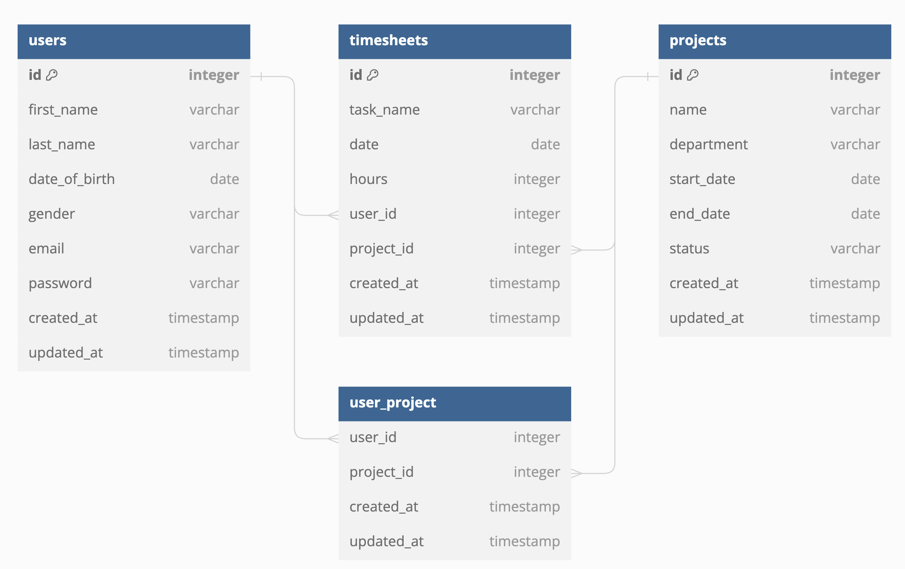

# Laravel API Assignment

## Overview

This project implements a RESTful API using Laravel for managing users, projects, and timesheets. The API provides endpoints for CRUD operations, user authentication, and filtering of records. The project was developed as an assignment to demonstrate the creation of models and their relationships, along with secure access to the API.

## Models and Relationships

The project includes the following models:

- **User:** Represents a user of the system. Each user has attributes like first name, last name, date of birth, gender, email, and password. A user can be associated with multiple projects and can log multiple timesheets.
- **Project:** Represents a project within the organization. Each project has a name, department, start date, end date, and status. A project can have multiple users and timesheets associated with it.
- **Timesheet:** Represents a log of hours worked by a user on a specific project. Each timesheet has a task name, date, and hours. It is linked to a specific user and project.

### Model Relationships

- **User - Project:** Many-to-Many relationship. A user can be part of multiple projects, and a project can have multiple users.
- **User - Timesheet:** One-to-Many relationship. A user can have multiple timesheets, but each timesheet is linked to one user.
- **Project - Timesheet:** One-to-Many relationship. A project can have multiple timesheets, but each timesheet is linked to one project.

## API Endpoints

### Authentication

- **Register:** `POST /api/register`
- **Login:** `POST /api/login`
- **Logout:** `POST /api/logout`

### User

- **Create User:** `POST /api/user`
- **Get User:** `GET /api/user/{id}`
- **Get All Users:** `GET /api/user`
- **Update User:** `POST /api/user/update`
- **Delete User:** `POST /api/user/delete`

### Project

- **Create Project:** `POST /api/project`
- **Get Project:** `GET /api/project/{id}`
- **Get All Projects:** `GET /api/project`
- **Update Project:** `POST /api/project/update`
- **Delete Project:** `POST /api/project/delete`

### Timesheet

- **Create Timesheet:** `POST /api/timesheet`
- **Get Timesheet:** `GET /api/timesheet/{id}`
- **Get All Timesheets:** `GET /api/timesheet`
- **Update Timesheet:** `POST /api/timesheet/update`
- **Delete Timesheet:** `POST /api/timesheet/delete`

### Filtering

All "Get All" endpoints support filtering via query parameters. You can filter results by providing the field values you want to filter on. For example, to filter users by first name and gender, use: `/api/user?first_name=John&gender=male`.

## Security

All endpoints are protected and require authentication. Users must be logged in to access the API. The system uses Laravel Sanctum for authentication, which provides token-based access.

## Postman Collection

You can find the Postman collection for testing the API [here](https://god.gw.postman.com/run-collection/7703084-d84f99f2-9450-4603-bac7-81fd320cd698?action=collection%2Ffork&source=rip_markdown&collection-url=entityId%3D7703084-d84f99f2-9450-4603-bac7-81fd320cd698%26entityType%3Dcollection%26workspaceId%3D0e8b32df-c40d-4132-968f-1d76e3121cc0). The collection includes all the endpoints with sample requests and responses.

The API documentation generated by Postman can be accessed [here](https://documenter.getpostman.com/view/7703084/2sA3rwMZRc).

## Installation

To set up the project locally:

1. Clone the repository: `git clone git@github.com:dophlin/astudio-timesheet.git`
2. Navigate to the project directory: `cd astudio-timesheet`
3. Install dependencies: `composer install`
4. Update the `.env` file and set up your environment variables, including database credentials.
5. Run migrations: `php artisan migrate`
6. Start the server: `php artisan serve`
7. Register a new user using **Register API:** `POST /api/register`
8. Login to the system using **Login API:** `POST /api/login`
9. Use the generated token for other API calls. You can refer to the API documentation.

## License

This project is licensed under the MIT License.
